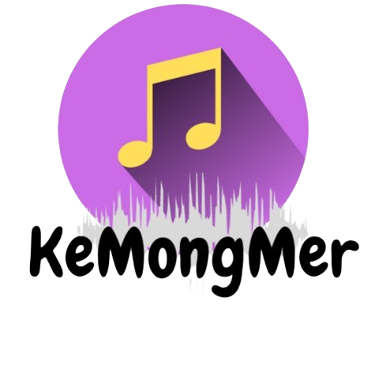
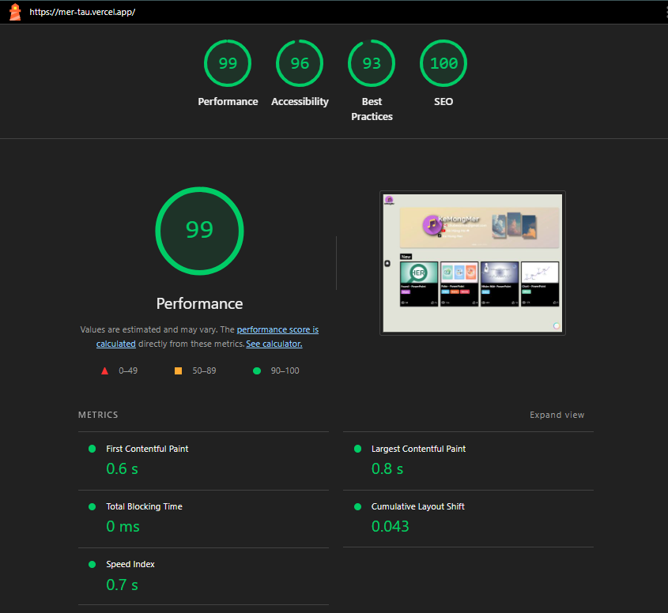

<p align="center">
  
</p>

# Mer - Transform Ideas into Stunning Slides!

A professional platform providing high-quality PowerPoint templates for impactful presentations

## 🎯 Overview

**Mer** is a specialized website that provides high-quality PowerPoint templates suitable for various purposes such as introductions, presentation endings, or creating special effects. With a diverse collection of templates and smart interactive features, Mer helps users quickly find and download the perfect templates for their presentations.

## 🎬 Demo Video

Watch our introduction video to see Mer in action:

[](https://www.youtube.com/watch?v=dZn2OPClFJw)

_Click the image above to watch the full demo on YouTube_

## ✨ Key Features

- 🌓 **Dark/Light Mode**: Comfortable viewing experience for both day and night users
- 🔍 **Smart Search Bar**: Intelligent search combined with category filters
- 📁 **Template Categories**: Intro, Outro, Music, and Effect templates
- 🔒 **Engagement-Based Downloads**: Templates unlock when YouTube videos reach 20+ likes
- 🤖 **AI Chatbot (MB)**: Virtual assistant for website support and guidance
- 📱 **Responsive Design**: Seamless experience across all devices
- 💾 **Ready-to-Use**: Downloaded files work immediately without complex setup

## 🎭 Template Categories

### 📝 Intro Templates

Perfect for team introductions or presentation openings

- Professional design patterns
- Eye-catching animations
- Customizable layouts

### 🎬 Outro Templates

Create impressive presentation endings

- Memorable closing designs
- Call-to-action layouts
- Thank you slides

### 🎵 Music Templates

Dynamic templates synchronized with music

- Audio-visual harmony
- Rhythm-based animations
- Entertainment-focused designs

### ✨ Effect Templates

Special effects to make slides more attractive

- Advanced animations
- Transition effects
- Visual impact elements

## 🛠️ Technology Stack

### Frontend

| Technology                                                                                                        | Description                                    |
| ----------------------------------------------------------------------------------------------------------------- | ---------------------------------------------- |
|                | JavaScript library for building user interface |
|  | Core programming language                      |
|                    | Styling and responsive design                  |
|                 | Markup language                                |

### Deployment

| Technology                                                                                            | Description               |
| ----------------------------------------------------------------------------------------------------- | ------------------------- |
|  | Cloud deployment platform |

## 📂 Project Structure

```
📁 Mer_WEB
│
├── 📁 node_modules/                # Installed packages directory
├── 📁 public/                      # Public static files
├── 📁 src/                         # Main source code
│   ├── 📁 api/                    # API integration and services
│   ├── 📁 components/             # Reusable UI components
│   ├── 📁 layouts/                # Page layout components
│   ├── 📁 pages/                  # Application pages
│   ├── 📁 style/                  # Styling files
│   ├── 📄 App.js                  # Main application component
│   ├── 📄 App.test.js             # Application tests
│   ├── 📄 index.css               # Root styling
│   ├── 📄 index.js                # Application entry point
│   ├── 📄 reportWebVitals.js      # Performance monitoring
│   └── 📄 setupTests.js           # Test configuration
|
├── 📄 .gitignore                  # Git ignore rules
├── 📄 LICENSE                     # Project license
├── 📄 package.json                # Project dependencies and scripts
├── 📄 package-lock.json           # Locked dependency versions
└── 📄 README.md                   # Project documentation
```

## 🚀 Getting Started

### Prerequisites

- Node.js (v16 or higher)
- npm or yarn package manager
- Modern web browser

### Installation & Setup

1. Clone the repository:

```bash
git clone https://github.com/yourusername/mer-website.git
cd mer-website
```

2. Install dependencies:

```bash
npm install
```

3. Create environment file:

```bash
cp .env
```

4. Configure environment variables:

```bash
# API Configuration
REACT_APP_API_BASE_URL=''
REACT_APP_YOUTUBE_API_KEY=''

# Application Settings
REACT_APP_NAME=Mer
REACT_APP_VERSION=1.0.0
REACT_APP_ENVIRONMENT=development
```

5. Start development server:

```bash
npm start
```

The application will run on `http://localhost:3000`

## 🔗 Live Demo & Links

- **🌐 Website**: https://mer-tau.vercel.app/
- **🎥 Introduction Video**: [YouTube](https://www.youtube.com/watch?v=dZn2OPClFJw)
- **🎨 UI/UX Design**:[Figma](https://www.figma.com/design/mKfsvvdfT1uoFQ22G8JqL7/Powerpoint?node-id=0-1&p=f&t=qmxloZy8JTJPrEQy-0)
- **📺 YouTube Channel**: [Kẻ Mộng Mơ ☁](https://youtube.com/@ke_mong_mer)
- **📱 TikTok**: [Ke Mong Mer](https://tiktok.com/@mongmerguy)

## 🤝 Contributing

We welcome contributions to make Mer even better!

### Development Process

1. Fork the repository
2. Create a feature branch (`git checkout -b feature/AmazingFeature`)
3. Commit your changes (`git commit -m 'Add some AmazingFeature'`)
4. Push to the branch (`git push origin feature/AmazingFeature`)
5. Open a Pull Request

## 📊 Performance Metrics



Based on Google Lighthouse audit:

- **Performance Score**: 99/100
- **Accessibility Score**: 96/100
- **Best Practices Score**: 93/100
- **SEO Score**: 100/100

Key Performance Indicators:

- **First Contentful Paint**: 0.6s
- **Largest Contentful Paint**: 0.8s
- **Total Blocking Time**: 0ms
- **Cumulative Layout Shift**: 0.043
- **Speed Index**: 0.7s

## 🌍 Browser Support

| Browser | Version |
| ------- | ------- |
| Chrome  | 70+     |
| Firefox | 65+     |
| Safari  | 12+     |
| Edge    | 79+     |
| Opera   | 57+     |

## 📞 Support & Contact

### Technical Support

- **📧 Email**: aohkne@gmail.com
- **💬 Facebook**: [Băng Băng](https://facebook.com/bang.bang.162972)
- **🤖 MB Chatbot**: Available on website

### Social Media

- **📺 YouTube**: [Kẻ Mộng Mơ ☁](https://youtube.com/@ke_mong_mer)
- **📱 TikTok**: [Ke Mong Mer](https://tiktok.com/@mongmerguy)

## 📄 License

This project is licensed under the MIT License - see the [LICENSE](LICENSE) file for details.

## 🙏 Acknowledgments

- Thanks to all users who engage with our content
- Special appreciation for the PowerPoint community
- Gratitude to contributors and supporters

## 🌟 Star Us on GitHub!

If you find Mer useful, please consider giving it a star ⭐ on GitHub to help others discover it.

[](Aohkne/Mer)
[](Aohkne/Mer/fork)
[](Aohkne/Mer)

---

<div align="center">

**Made with ❤️ by the Mer**

[Website](https://mer-tau.vercel.app/) • [YouTube](https://youtube.com/@ke_mong_mer) • [TikTok](https://tiktok.com/@mongmerguy) • [Contact](mailto:aohkne@gmail.com)

</div>
